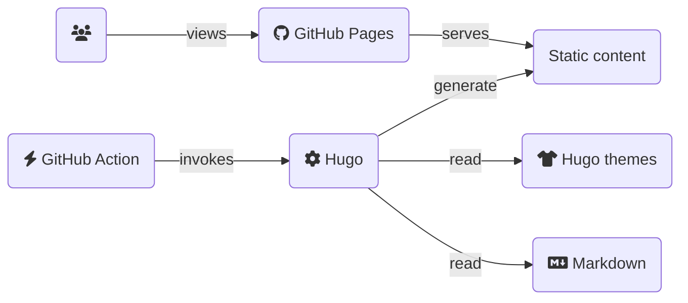

## Supported Diagramming

### Mermaid

[Mermaid](https://mermaid-js.github.io/mermaid/#/) has [first class support](https://www.docsy.dev/docs/adding-content/lookandfeel/#diagrams-with-mermaid) in the Docsy theme. This allows you to use code fences to build a block to illustrate a diagram.



To try different ways of building these diagrams, [try out their live editor](https://mermaid-js.github.io/mermaid-live-editor/).

### Markmap

[Markmap](https://markmap.js.org/) is also supported in the theme, allowing you to visual a mindmap.

```markmap
# Docs as Code

## Markdown

## Hugo
* docsy theme
* reveal-hugo theme

## GitHub Pages

## GitHub Actions
```

## Others Projects

Here are some other projects that can enable you to leverage this approach in your projects:

* [Mermaid](https://mermaid-js.github.io/mermaid/#/): Mermaid lets you create diagrams and visualizations using text and code.
* [Diagrams as Code](https://diagrams.mingrammer.com/): Diagrams lets you draw the cloud system architecture in Python code.
* [Structurizr](https://structurizr.com/help/dsl): Allows you to create multiple diagrams based upon the [C4 model](https://c4model.com/), in multiple output formats, from a single DSL source file.

