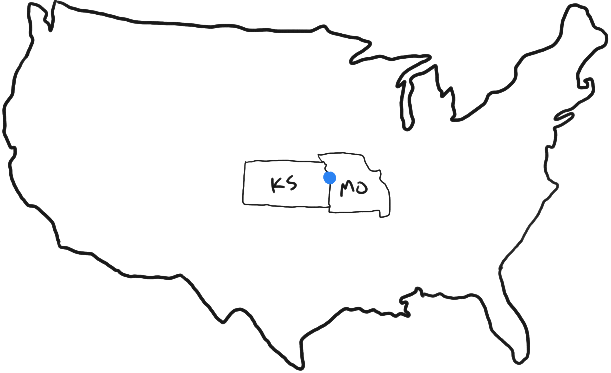

<h1 style="text-align: left">DOCS  AS CODE</h1>

  
  
    Carl Chesser
     
    <small><a href="https://twitter.com/che55er">@che55er</a> | <a href="https://che55er.io/">che55er.io</a></small>
  

 

---

<section data-noprocess>
  <h2>About Me</h2>
  <section data-auto-animate>
     
  </section>
  <section data-auto-animate>
     
     
  </section>
  <section data-auto-animate>
     
     
     
  </section>
</section>

---


<section data-noprocess data-state="make-it-pop">
    <h2><a href="https://che55er.io">Guides through Drawings</a></h2>
</section>

---

# Outline
🔍 Introduction  📚 History  🚀 Examples 

---

# 📄 🧑‍💻
## Docs as Code?

> Documentation as Code (Docs as Code) refers to a philosophy that you should be writing documentation with the same tools as code:
> 
> * Issue Trackers 
> * Version Control (git) 
> * Plain Text Markup (Markdown, reStructuredText, Asciidoc)
> * Code Reviews
> * Automated Tests

---

## History

---

# 📚 
## Twitter

TODO: Write the Docs references / year

---

# 📚 
## Google

TODO: DoWrite the Docs references / year

---

<section data-noprocess>
<h2>GitHub Actions</h2>
<pre><code data-line-numbers="3-5|8-10|13-15">
<table>
  <tr>
    <td>Apples</td>
    <td>$1</td>
    <td>7</td>
  </tr>
  <tr>
    <td>Oranges</td>
    <td>$2</td>
    <td>18</td>
  </tr>
  <tr>
    <td>Kiwi</td>
    <td>$3</td>
    <td>1</td>
  </tr>
</table>
</code></pre>
</section>

---