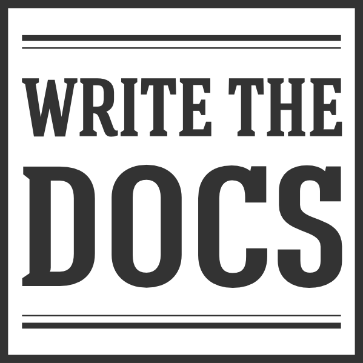



Fantastic resource 👇

---

## Docs as Code?

Documentation as Code (Docs as Code) refers to a philosophy that you should be writing documentation with the _same tools as code_.

<small><em>Source: <a href="https://www.writethedocs.org/guide/docs-as-code/">Write the Docs</a></em></small>

---

<h2>Docs as Code uses...</h2>
<small><em>Source: <a href="https://www.writethedocs.org/guide/docs-as-code/">Write the Docs</a></em></small>

🐞 Issue Trackers

🌳 Version Control (git)

🔤 Plain Text Markup <small>(Markdown, reStructuredText, Asciidoc)</small>

💬 Code Reviews

✅ Automated Tests

---

## 🐞 Issue Trackers

Align tracking the work of documentation with code. 
<small>(have it live in the same queue)</small>

---

<h2>🌳 Version Control (git)</h2>

Enable docs and code to live in same changeset <small>(like your tests)</small>

Enable concurrent development branches

<small>🌈 Enable all the features of version control for your documentation!</small>

---

## 🔤 Plain Text Markup

Enable all the features of your code editors in documentation 
<small>
(compare, find/replace, track in version control)

🌈 Many editors with preview mode for Markdown as you edit!

</small>

---

## 💬 Code Reviews

Enable discussions with code using the same toolchain 
<small>(line-by-line comments, suggestions they can apply, CODEOWNERS)</small>

---

## ✅ Automated Tests

Enable static analysis tests on documentation
<small>(status checks on pull requests)</small>

---



<h2>Creating the Culture of Documentation</h2> </a>
<a href="https://youtu.be/6y4eQ6gYwdU" target="_blank"><small>Write the Docs (Twitter, 2014)</small></a>

---



  <h3>Documentation, Disrupted</h3>
  <h4>How Two Technical Writers Changed Google Engineering Culture</h4>
<a href="https://youtu.be/EnB8GtPuauw" target="_blank"><small>Write the Docs (Google, 2015)</small></a>

---



  <h3>How we are solving internal technical documentation at Spotify</h3>
<a href="https://youtu.be/uFGCaZmA6d4" target="_blank"><small>Write the Docs (Spotify, 2019)</small></a>

---



<a href="https://backstage.io/blog/2020/09/08/announcing-tech-docs" target="_blank"><h3>Open-sourced September 2020!</h3></a>

---

<h2>Problematic Signals</h2>

🏝 Islands of documentation <small>(MediaWiki, Confluence, Office 365, READMEs, GitHub Pages)</small>

📜 Excessive documentation decay  <small>(possibly caused by  islands)</small>

🔍 Searchability challenges

🤷‍♂️ Different process for maintaining (vs. with code)

😐 Lack of trust on the content

---

<section data-auto-animate>
  
🏝 Islands of documentation <small>(MediaWiki, Confluence, Office 365, READMEs, GitHub Pages)</small> 
  📜 Documentation decay due to islands 
  🔍 Searchability challenges 
  

</section>
<section data-auto-animate>
  
🏝 Islands of documentation <small>(MediaWiki, Confluence, Office 365, READMEs, GitHub Pages)</small> 
  📜 Documentation decay due to islands 
  🔍 Searchability challenges 
  

  
🌎 A centralized build system for documentation that can enable content through a common convention

</section>

---

<section data-auto-animate>
  
🤷‍♂️ Different process for maintaining (vs. with code)

</section>
<section data-auto-animate>
  
🤷‍♂️ Different process for maintaining (vs. with code)

  
🧰 Enable documentation to exist closer to the code and toolchain

</section>

---

<section data-noprocess>
  <section data-auto-animate>
    
😐 Lack of trust on the content

  </section>
  <section data-auto-animate>
    
😐 Lack of trust on the content

    
🪄 Make it easy for anyone to contribute 
    <small>help them along the way, like DocDays!</small>

  </section>
</section>

---

But, not everyone has GitHub access...

or knows Markdown. 
🤷‍♂️

---

## 🧩 

Ensure approach aligns with strategy for expected toolchain access 
<small>(GitHub Enterprise)</small>

---

## 🔤

Illustrate through examples that if <u>you know text</u>,  you <u>can write Markdown</u> 
<small>Majority of contributions = textual content, ≠ formatting</small>
