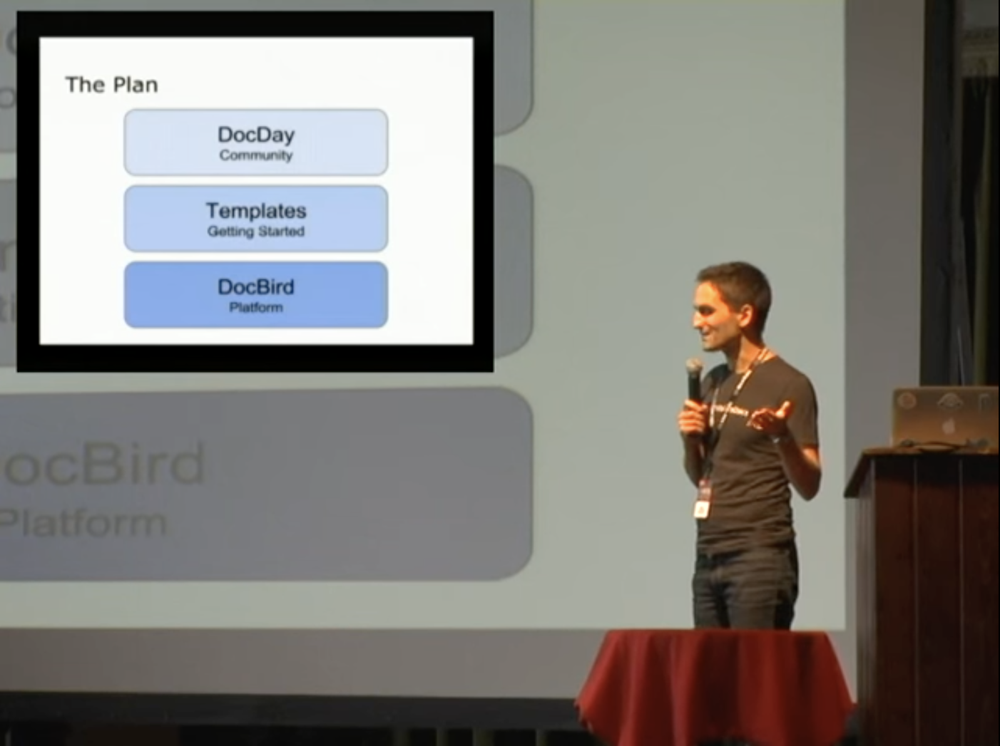
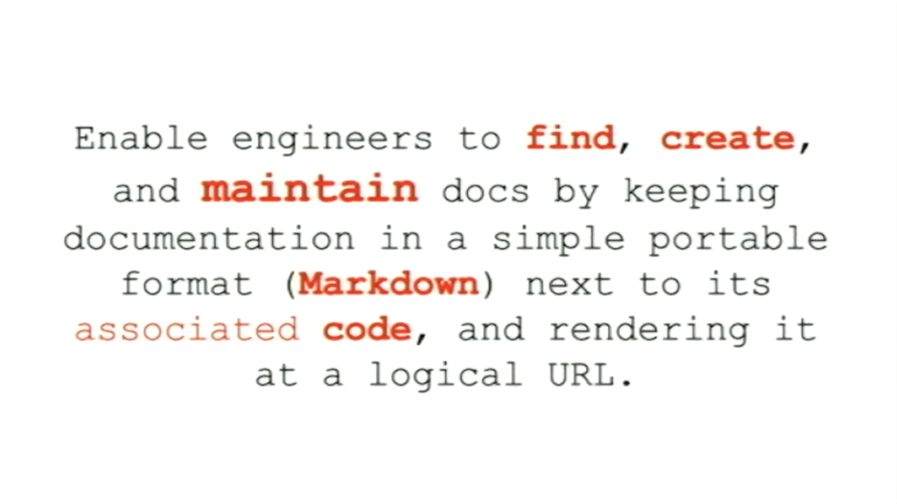
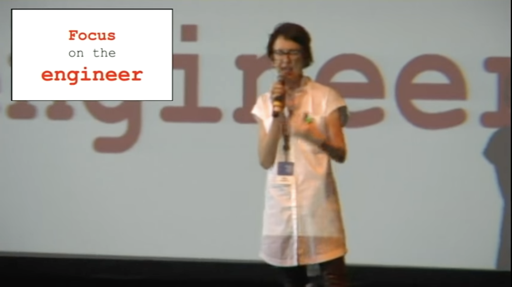
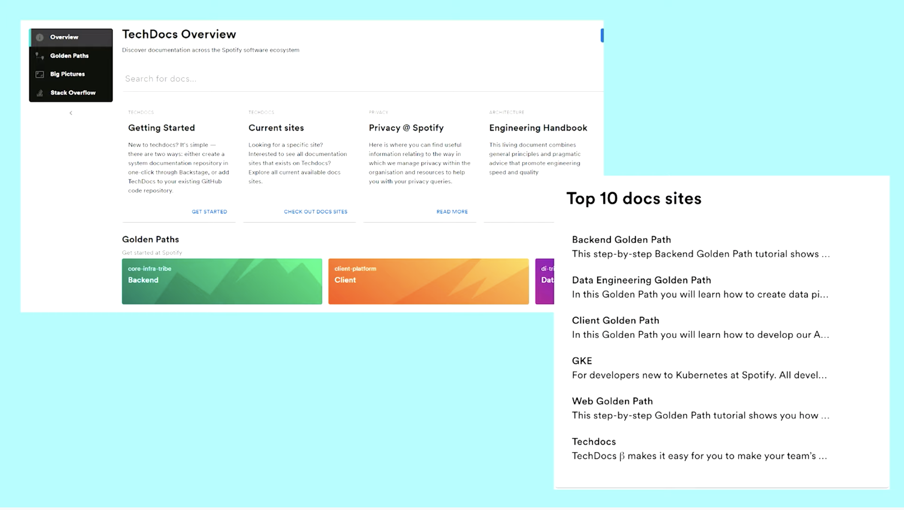
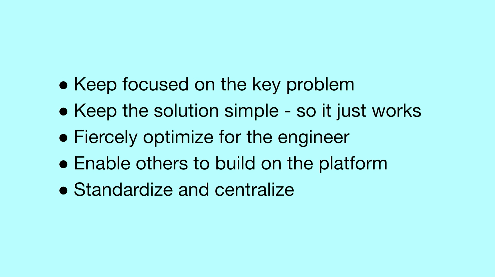

Fantastic source 👇

---

## Docs as Code?

Documentation as Code (Docs as Code) refers to a philosophy that you should be writing documentation with the _same tools as code_.

<small><em>Source: <a href="https://www.writethedocs.org/guide/docs-as-code/">Write the Docs</a></em></small>

---

<section data-noprocess>
  <h2>Docs as Code uses...</h2>
  <small><em>Source: <a href="https://www.writethedocs.org/guide/docs-as-code/">Write the Docs</a></em></small>
  
🐞 Issue Trackers

  
🌳 Version Control (git)

  
🔤 Plain Text Markup <small>(Markdown, reStructuredText, Asciidoc)</small>

  
💬 Code Reviews

  
✅ Automated Tests

</section>

---

## 🐞 Issue Trackers

Align tracking the work of documentation with code. 
<small>(have it live in the same queue)</small>

---

<section data-noprocess>
  <h2>🌳 Version Control (git)</h2>
  
Enable docs and code in same changeset <small>(like your tests)</small>

  
Enable concurrent development branches

  
<small>🌈 Enable all the feature of version controls for documentation!</small>

</section>

---

## 🔤 Plain Text Markup

Enable all the features of your code editors in documentation
<small>(compare, find/replace, track in version control)</small>

---

## 💬 Code Reviews

Enable discussions with code using the same toolchain 
<small>(line-by-line comments, suggestions they can apply, CODEOWNERS)</small>

---

## ✅ Automated Tests

Enable static analysis tests on documentation
<small>(status checks on pull requests)</small>

---

<section data-noprocess>
  <h3>Creating the Culture of Documentation</h3>
  
Twitter: 2014

    
  <small class="fragment"><a href="https://youtu.be/EnB8GtPuauw">📽 Watch it!</a></small>
</section>

---

<section data-noprocess>
  <h3>Documentation, Disrupted</h3>
  <h4>How Two Technical Writers Changed Google Engineering Culture</h4>
  
Google: 2015

  
   
  <small class="fragment"><a href="https://youtu.be/EnB8GtPuauw">📽 Watch it!</a></small>
</section>

---

<section data-noprocess>
  <h4>How we are solving internal technical documentation at Spotify </h4>
  
Spotify: 2019

  
   
  <small class="fragment"><a href="https://youtu.be/uFGCaZmA6d4">📽 Watch it!</a></small>
</section>

---

<section data-background-iframe="https://backstage.io/blog/2020/09/08/announcing-tech-docs" data-background-interactive>
</section>

---

<section data-noprocess>
  <h2>Problematic Signals</h2>
  
🏝 Islands of documentation <small>(MediaWiki, Confluence, Office 365, READMEs, GitHub Pages)</small>

  
📜 Documentation decay due to islands

  
🔍 Searchability challenges

  
🤷‍♂️ Different process for maintaining (vs. with code)

  
😐 Lack of trust on the content

</section>

---

<section data-noprocess>
  <section data-auto-animate>
    
🏝 Islands of documentation <small>(MediaWiki, Confluence, Office 365, READMEs, GitHub Pages)</small> 
    📜 Documentation decay due to islands 
    🔍 Searchability challenges 
    

  </section>
  <section data-auto-animate>
    
🏝 Islands of documentation <small>(MediaWiki, Confluence, Office 365, READMEs, GitHub Pages)</small> 
    📜 Documentation decay due to islands 
    🔍 Searchability challenges 
    

    
🌎 A centralized build system for documentation that can enable content through a common convention
    

  </section>
</section>

---

<section data-noprocess>
  <section data-auto-animate>
    
🤷‍♂️ Different process for maintaining (vs. with code)

  </section>
  <section data-auto-animate>
    
🤷‍♂️ Different process for maintaining (vs. with code)

    
🧰 Enable documentation to exist closer to the code and toolchain

  </section>
</section>

---

<section data-noprocess>
  <section data-auto-animate>
    
😐 Lack of trust on the content

  </section>
  <section data-auto-animate>
    
😐 Lack of trust on the content

    
🪄 Make it easy for anyone to contribute (help them along the way)

  </section>
</section>

---

But, not everyone has GitHub access...

or knows Markdown. 
🤷‍♂️

---

---

---