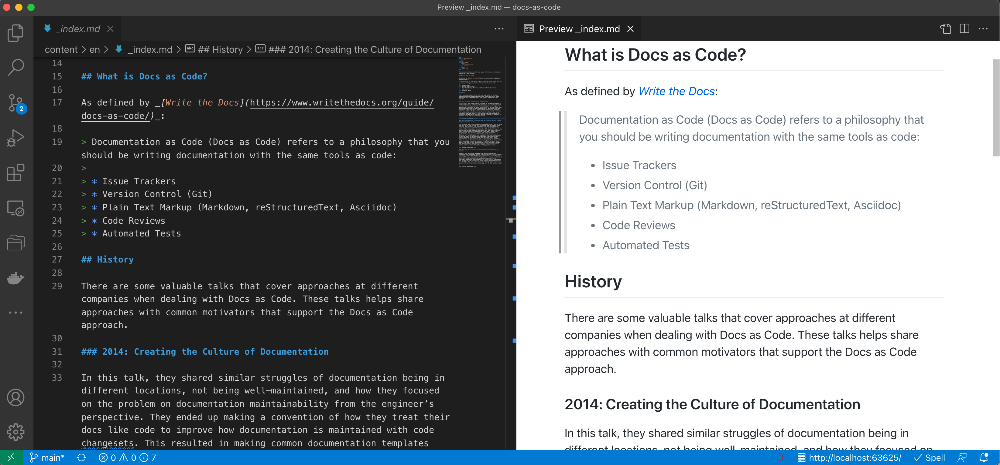



## 🚀
## Examples

<strong>🔤 Markdown</strong>: Authoring

<strong>⚙️ Hugo</strong>: Generating

<strong>👔 Docsy</strong>: Theming

<strong>⚡️ GitHub Actions</strong>: Building

<strong>📑 GitHub Pages</strong>: Serving

---

## 🔤
## Markdown

Markdown is a lightweight markup language that you can use to add formatting elements to plaintext text documents. Created by John Gruber in 2004, Markdown is now one of the world’s most popular markup languages.

<small>Source: [The Markdown Guide](https://www.markdownguide.org/)</small>

---

## Editing

---

Great resource 👇

---

The world’s fastest framework for building websites

https://gohugo.io/

---

<h2>Hugo Features</h2>

🦄 Shortcodes  
  <small>Powerful way to extend beyond Markdown with reusable code blocks</small>

🪴 Multiple Formats  
  <small>Hugo allows you to output your content in multiple formats...like this presentation</small>

🦥 Flexible  
  <small>Build different types of content (menus, diagrams) to make a rich website out of Markdown</small>

⚡️ Speed  
  <small>At < 1 ms per page, the average site builds in less than a second</small>

---



<a href="https://opensource.googleblog.com/2019/07/announcing-docsy-website-theme-for.html" target="_blank"><h3>Open-sourced July 2019!</h3></a>

---



A <a href="https://opensource.googleblog.com/2019/07/announcing-docsy-website-theme-for.html" target="_blank">Hugo theme</a> for creating great technical documentation sites

---

## 👔
## Docsy Examples

  
  
  

---

## 🦄
## Shortcodes

Generate API documentation from your OpenAPI (Swagger) specifications.

<pre><code style="text-align: center">
</code></pre>

---

## 🧜‍♀️ 
## Diagrams: Mermaid

<pre><code data-line-numbers="2|3|4-6">

</code></pre>

---

## GitHub Actions

Build your docs! 

<small>Include in `.github/workflows/gh-pages.yaml` file.</small>

<pre><code data-line-numbers="3-7|46-51">name: github pages

on:
  push:
    branches:
      - main
  pull_request:

jobs:
  deploy:
    runs-on: ubuntu-20.04
    concurrency:
      group: ${{ github.workflow }}-${{ github.ref }}
    steps:
      - uses: actions/checkout@v2
        with:
          submodules: recursive  # Fetch the Docsy theme
          fetch-depth: 0         # Fetch all history for .GitInfo and .Lastmod

      - name: Setup Hugo
        uses: peaceiris/actions-hugo@v2
        with:
          # Can pin to a specific version if needed, ex:
          # hugo-version: '0.79.1'
          hugo-version: 'latest'
          extended: true

      - name: Setup Node
        uses: actions/setup-node@v2
        with:
          node-version: '14'

      - name: Cache dependencies
        uses: actions/cache@v1
        with:
          path: ~/.npm
          key: ${{ runner.os }}-node-${{ hashFiles('**/package-lock.json') }}
          restore-keys: |
            ${{ runner.os }}-node-

      - run: npm ci
      - run: hugo
        env:
          HUGO_ENV: production

      - name: Deploy
        uses: peaceiris/actions-gh-pages@v3
        if: ${{ github.ref == 'refs/heads/main' }}
        with:
          github_token: ${{ secrets.GITHUB_TOKEN }}
          publish_branch: gh-pages</code></pre>

---

## 📑
## GitHub Pages

⚒️ Build and test your docs on pull requests

🧆 Generate and store static content for serving

---

## 🧪
## Try it out!

Try out <a href="/docs-as-code" target="_self" >the example site</a> by:

✍️ Use <em>Edit this Page</em> to make a change via a PR

⚙️ See build process on pull request and preview

